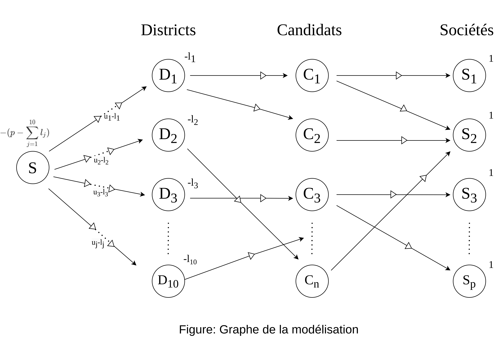

# Choix d’une assemblée de délégués - Labo 3 GRE

Auteurs: Simon Menicot, Samuel Roland

## Introduction

On cherche à modéliser le problème de la recherche de l'assemblée des délégués de l’association cantonale vaudoise de gymnastique par un problème de la théorie des graphes.

## Modélisation du problème

Pour cela, on utilise le graphe suivant :
- Des sommets $D_j, ~ j = 1,\ldots,10$ représentant les districts, avec une offre de $l_j$ pour garantir le minimum de délégués par district.

- Un sommet source $S$, avec une offre de $\displaystyle p - \sum_{j=1}^{10}l_j$ pour représenter l'offre non fournie par les minimums de membres des districts.

- Des arcs $(S,D_j),~ j = 1,\ldots,10$ de capacité $u_j - l_j$ pour empêcher de dépasser le maximum de délégués pour chaque district.

- Des sommets $C_i, ~ i = 1,\ldots,n$ représentant les candidats.

- Des sommets $S_k, ~ k = 1,\ldots,p$ représentant les sociétés de gymnastique, de demande 1 pour que chaque société ait un délégué.

- Des arcs $(D_j,C_i)$ lorsque le candidat $i$ habite dans le district $j$, de capacité 1 pour s'assurer que le candidat sera choisi pour une seule place de délégué (dans le cas où il serait membre de plusieurs sociétés, il risquerait d'être compté plusieurs fois comme délégué).

- Des arcs $(C_i,S_k)$ lorsque le candidat $i$ fait partie de la société $k$, avec une capacité de 1.

## Type de problème
Il s'agit d'un problème de transbordement. Si, lors de la résolution de ce problème, les demandes sont respectées (c'est-à-dire un délégué par société), alors il existe une solution au problème (c'est-à-dire une sélection admissible de délégués), et les candidats sélectionnés sont ceux où transite un flux de 1 sur leur sommet $C_i$.

